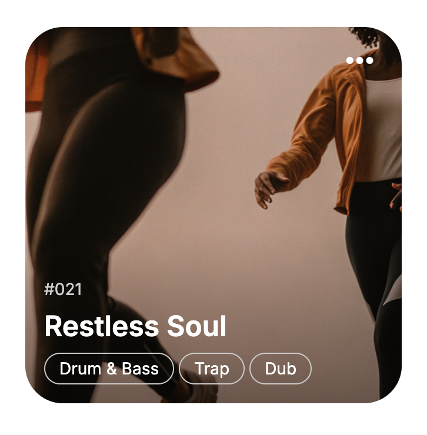

# Laboratorio Módulo Layout

## Descripción

Este proyecto contiene los ejercicios del laboratorio básico del módulo Layout, donde se implementan diferentes técnicas de diseño web moderno utilizando Sass, temas CSS, Flexbox y Grid CSS.

## Ejercicio 1: Paleta de Colores Dinámica con Sass

**Objetivo:** Crear una paleta de colores generada dinámicamente a partir de un color base usando Sass.

**Archivos principales:**

- `/styles/main.scss`
- `index.html`

**Resultado esperado:**

## Ejercicio 2: Sistema de Temas CSS

**Objetivo:** Implementar dos temas distintos (Tema A y Tema B) que afecten colores, fuentes, border radius y box shadows.

**Archivos principales:**

- `styles.css`
- `index.html`

**Resultado**

## Ejercicio 3: Barra de Navegación Responsive con Flexbox

**Objetivo:** Crear una barra de navegación responsive que se adapte a diferentes resoluciones usando Flexbox y media queries.

**Archivos principales:**

- `styles.css`
- `index.html`

**Resultado**

## Ejercicio 4: Card con Grid CSS

**Objetivo:** Diseñar un componente card utilizando CSS Grid para el layout y alineaciones.

**Archivos principales:**

- `styles.css`
- `index.html`

**Resultado**

## Instalación y Uso

1. Clonar o descargar el proyecto
2. Instalar dependencias con `npm install` y lanzar localhost con `npm run dev`
3. Para los ejercicios con Sass, compilar los archivos `.scss` a `.css` usando el comando:
